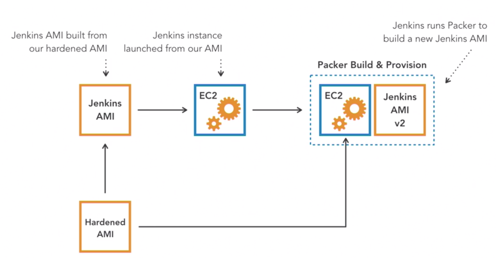

# packer-jenkins-server

## Build an Jenkins server with latest AMI.

It has an AMI with os and ssh hardening. It also has Jenkins and ansible on the AMI.

If you run the EC2 based on this AMI, teh jenkins server can be run on public dns.
Jenkins is running on port 8080 and username: admin and password: admin.

This packer project checkout the latest AMI and install following ansible package on it.

 - geerlingguy.jenkins
 - geerlingguy.ansible-role-packer
 - geerlingguy.ansible
 - dev-sec.ssh-hardening
 - dev-sec.os-hardening

## Model

In the Jenkins server, we could create a Jenkins task to automate the creation of this AMI with Packer.

Create Jenkins task, with pipeline project type. Then  add this repository into the Jenkins tasks SCM (run from git).
This task with run and create a new ami.

The Jenkinsfile file includes 4 stages of creating AMI with packer.

